---
## Front matter
lang: ru-RU
title: Установка ОС на виртуальную машину
author: |
   Разанацуа Сара Естэлл

institute: |
  Российский Университет Дружбы Народов

date: 21 февраля, 2025, Москва, Россия

## Formatting
mainfont: PT Serif
romanfont: PT Serif
sansfont: PT Sans
monofont: PT Mono
toc: false
slide_level: 2
theme: metropolis
header-includes: 
 - \metroset{progressbar=frametitle,sectionpage=progressbar,numbering=fraction}
 - '\makeatletter'
 - '\beamer@ignorenonframefalse'
 - '\makeatother'
aspectratio: 43
section-titles: true

---

# Цели и задачи работы

## Цель лабораторной работы

Целью данной работы является приобретение практических навыков установки операционной системы на виртуальную машину, настройки минимально необходимых для дальнейшей работы сервисов

# Процесс выполнения лабораторной работы

## Создаю виртуальную машину

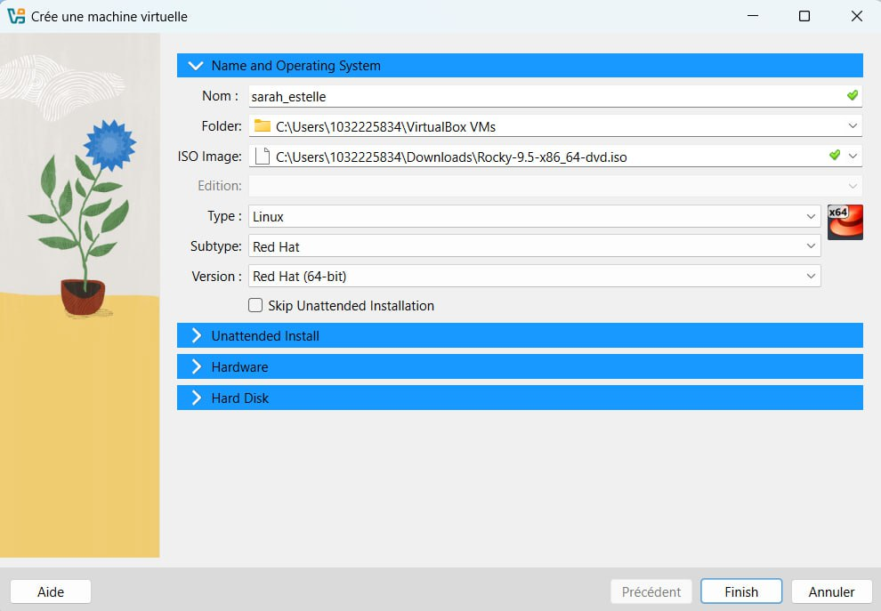{ #fig:001 width=70% height=70% }

## Установка OC Rocky

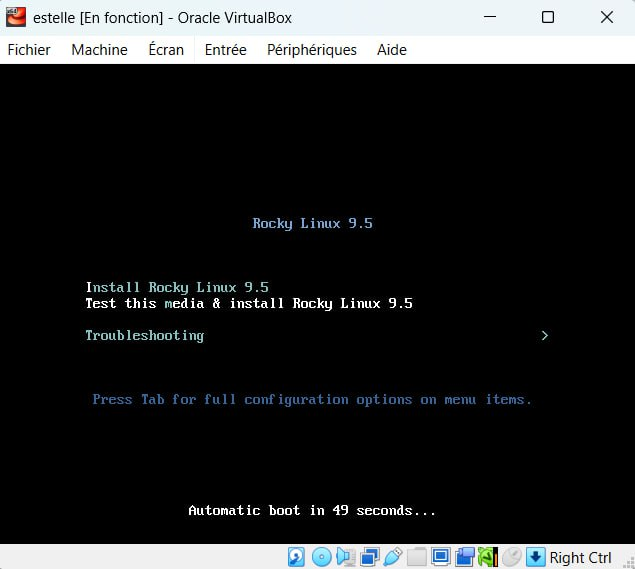{ #fig:002 width=70% height=70% }

## Установка языка

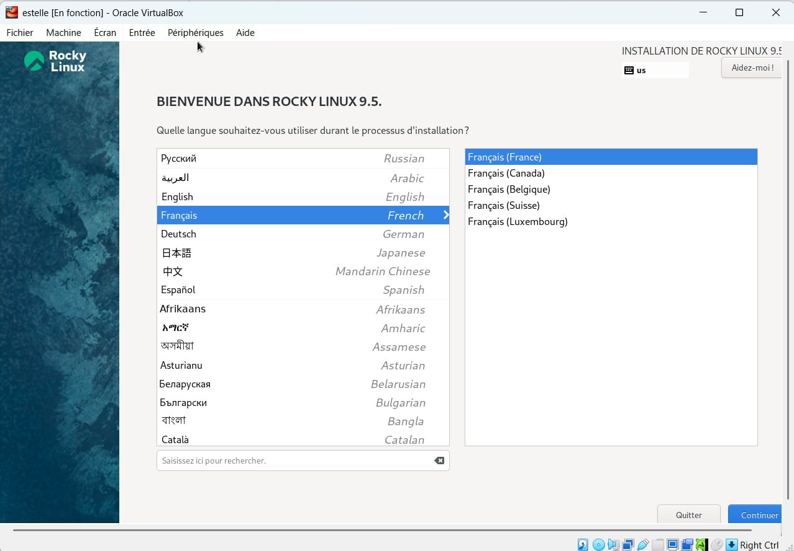{ #fig:003 width=70% height=70% }

## Параметры установки

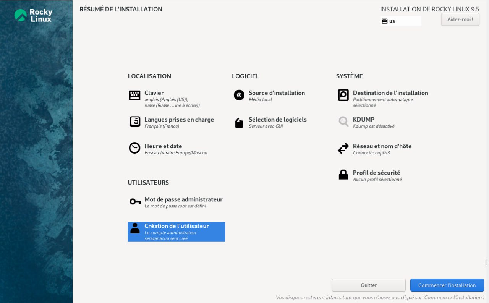{ #fig:004 width=70% height=70% }

## Информация по машине

1. Версия ядра Linux (Linux version). 

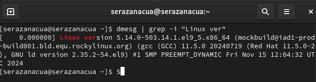{ #fig:006 width=70% height=70% }

2. Частота процессора (Detected Mhz processor). 

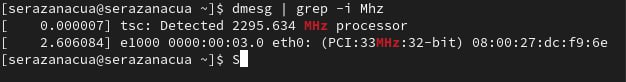{ #fig:007 width=70% height=70% }

3. Модель процессора (CPU0). 

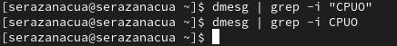{ #fig:008 width=70% height=70% }

4. Объем доступной оперативной памяти (Memory available). 

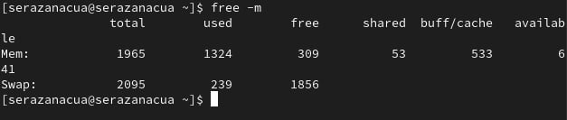{ #fig:009 width=70% height=70% }

5. Тип обнаруженного гипервизора (Hypervisor detected).

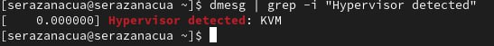{ #fig:010 width=70% height=70% }

6. Тип файловой системы корневого раздела.

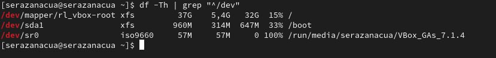{ #fig:011 width=70% height=70% }

7. Последовательность монтирования файловых систем.

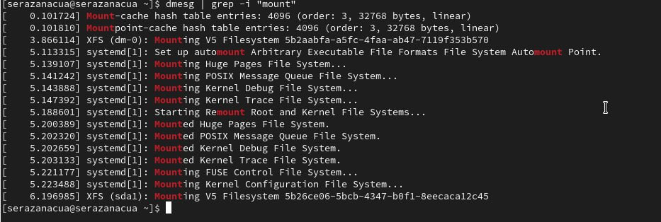{ #fig:012 width=70% height=70% }

# Выводы по проделанной работе

## Вывод

Мы приобрели практические навыки установки операционной системы на виртуальную машину, настройки минимально необходимых для дальнейшей работы сервисов.
