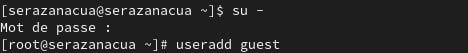
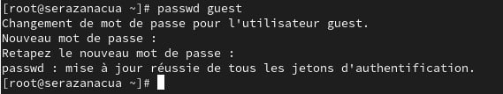
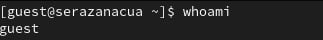
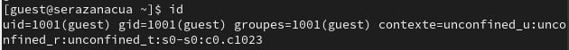
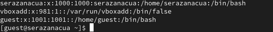
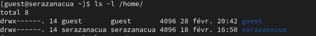
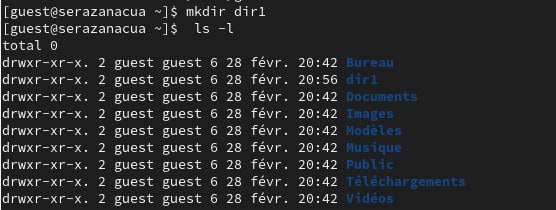
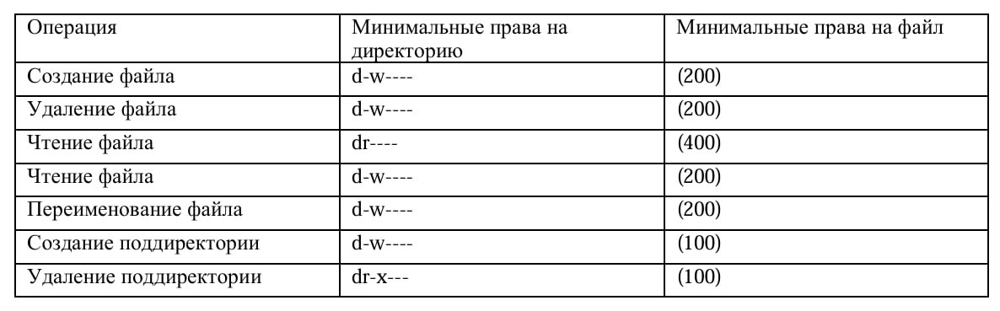

---
## Front matter
lang: ru-RU
title: Дискреционное разграничение прав в Linux. Основные атрибуты
author: |
	 Разанацуа Сара Естэлл  НКАбд-02-23\inst{1}

institute: |
	\inst{1}Российский Университет Дружбы Народов

date: 28 февраля 2025, Москва, Россия

## Formatting
mainfont: PT Serif
romanfont: PT Serif
sansfont: PT Sans
monofont: PT Mono
toc: false
slide_level: 2
theme: metropolis
header-includes: 
 - \metroset{progressbar=frametitle,sectionpage=progressbar,numbering=fraction}
 - '\makeatletter'
 - '\beamer@ignorenonframefalse'
 - '\makeatother'
aspectratio: 169
section-titles: true

---
# Информация

:::::::::::::: {.columns align=center}
::: {.column width="70%"}

  * Разанацуа Сара Естэлл
  * Студент, НКАбд-02-23
  * Российский университет дружбы народов
  * [1032225834@pfur.ru](mailto: 1032225834@pfur.ru)

:::
::: {.column width="30%"}

:::
::::::::::::::

# Цели и задачи работы

## Цель лабораторной работы

Получение практических навыков работы в консоли с атрибутами файлов, закрепление теоретических основ дискреционного разграничения доступа в современных системах с открытым кодом на базе ОС Linux. 

# Процесс выполнения лабораторной работы

## Определяем UID
 Cоздаем учётную запись пользователя guest.
 
{ #fig:001 width=80% height=80% }

## Определяем UID 
Cоздаем его пароль.

{ #fig:002 width=80% height=80% }

## Определяем UID 
Информация о пользователе guest

Уточните имя вашего пользователя командой whoami.

{#fig:003 width=70%}

## Определяем UID 
Сравните вывод id с выводом команды groups.

{#fig:004 width=70%}

## Файл с данными о пользователях
посмотрим на файл /etc/passwd и найдем в нём свою учётную запись.

{ #fig:005 width=80% height=80% }

## Доступ к домашним директориям
Определите существующие в системе директории командой ls -l /home/

{ #fig:006 width=80% height=80% }

## Атрибуты директории
Cоздаем в домашней директории поддиректорию dir1 командой mkdir dir1

{ #fig:007 width=70% height=70% }

## Права и разрешённые действия

{ #fig:008 width=80% height=80% }

# Выводы по проделанной работе

## Вывод

В ходе выполнения лабораторной работы были получены навыки работы с атрибутами файлов и сведения о разграничении доступа.

