---
## Front matter
title: "Лабораторная работа № 2"
subtitle: "Основы информационной безопасности"
author: "Разанацуа Сара Естэлл"

## Generic otions
lang: ru-RU
toc-title: "Содержание"

## Bibliography
bibliography: bib/cite.bib
csl: pandoc/csl/gost-r-7-0-5-2008-numeric.csl

## Pdf output format
toc: true # Table of contents
toc-depth: 2
lof: true # List of figures
lot: true # List of tables
fontsize: 12pt
linestretch: 1.5
papersize: a4
documentclass: scrreprt
## I18n polyglossia
polyglossia-lang:
  name: russian
  options:
	- spelling=modern
	- babelshorthands=true
polyglossia-otherlangs:
  name: english
## I18n babel
babel-lang: russian
babel-otherlangs: english
## Fonts
mainfont: IBM Plex Serif
romanfont: IBM Plex Serif
sansfont: IBM Plex Sans
monofont: IBM Plex Mono
mathfont: STIX Two Math
mainfontoptions: Ligatures=Common,Ligatures=TeX,Scale=0.94
romanfontoptions: Ligatures=Common,Ligatures=TeX,Scale=0.94
sansfontoptions: Ligatures=Common,Ligatures=TeX,Scale=MatchLowercase,Scale=0.94
monofontoptions: Scale=MatchLowercase,Scale=0.94,FakeStretch=0.9
mathfontoptions:
## Biblatex
biblatex: true
biblio-style: "gost-numeric"
biblatexoptions:
  - parentracker=true
  - backend=biber
  - hyperref=auto
  - language=auto
  - autolang=other*
  - citestyle=gost-numeric
## Pandoc-crossref LaTeX customization
figureTitle: "Рис."
tableTitle: "Таблица"
listingTitle: "Листинг"
lofTitle: "Список иллюстраций"
lotTitle: "Список таблиц"
lolTitle: "Листинги"
## Misc options
indent: true
header-includes:
  - \usepackage{indentfirst}
  - \usepackage{float} # keep figures where there are in the text
  - \floatplacement{figure}{H} # keep figures where there are in the text
---

# 2.1. Цель работы

- Получение практических навыков работы в консоли с атрибутами файлов, закрепление теоретических основ дискреционного разграничения доступа в современных системах с открытым кодом на базе ОС Linux1.

# 2.2 Порядок выполнения работы

Постарайтесь последовательно выполнить все пункты, занося ваши ответы на поставленные вопросы и замечания в отчёт.

1. создайте учётную запись пользователя guest (использую учётную запись администратора): useradd guest. (рис. [-@fig:001]).

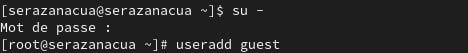{#fig:001 width=70%}

2. Задайте пароль для пользователя guest (использую учётную запись администратора): passwd guest. (рис. [-@fig:002]).

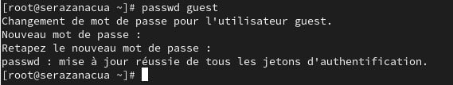{#fig:002 width=70%}

3. Войдите в систему от имени пользователя guest.(рис. [-@fig:003]).

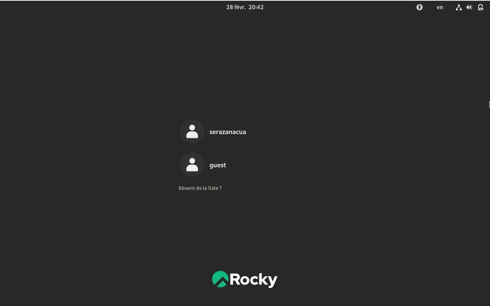{#fig:003 width=70%}

4. Определите директорию, в которой вы находитесь, командой pwd.(рис. [-@fig:004]). 

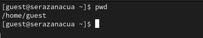{#fig:004 width=70%}

5. Уточните имя вашего пользователя командой whoami.(рис. [-@fig:005]).

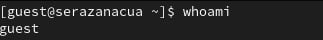{#fig:005 width=70%}

6. Сравните вывод id с выводом команды groups.(рис. [-@fig:006]). (рис. [-@fig:007]).

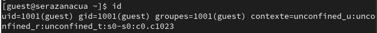{#fig:006 width=70%}

(рис. [-@fig:007]).

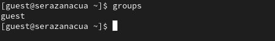{#fig:007 width=70%}

7. Сравните полученную информацию об имени пользователя с данными,
выводимыми в приглашении командной строки.(рис. [-@fig:008]).

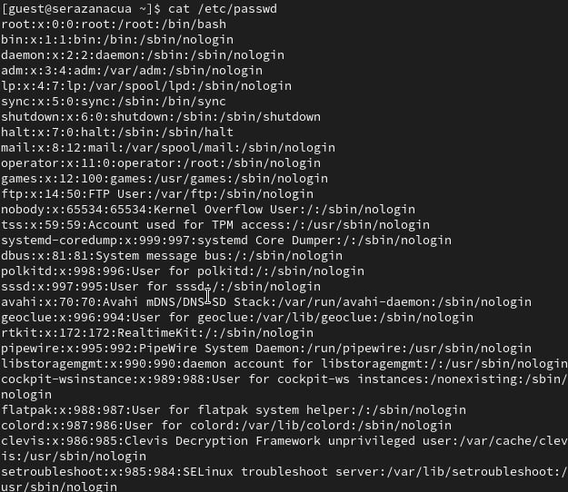{#fig:008 width=70%}

8. Просмотрите файл /etc/passwd командой : cat /etc/passwd. (рис. [-@fig:009]).

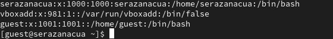{#fig:009 width=70%}

 
  cat /etc/passwd | grep guest  (рис. [-@fig:010]).
 
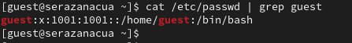{#fig:010 width=70%}
 
 9. Определите существующие в системе директории командой : ls -l /home/ (рис. [-@fig:011]).
 
 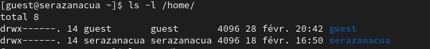{#fig:011 width=70%}
 
 10. Проверьте, какие расширенные атрибуты установлены на поддиректо-
риях, находящихся в директории /home, командой: lsattr /home (рис. [-@fig:012]).
 
 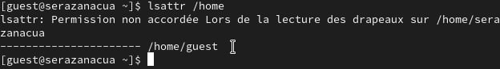{#fig:012 width=70%}
 
 11. Создайте в домашней директории поддиректорию dir1 командой : mkdir dir1 (рис. [-@fig:013]).

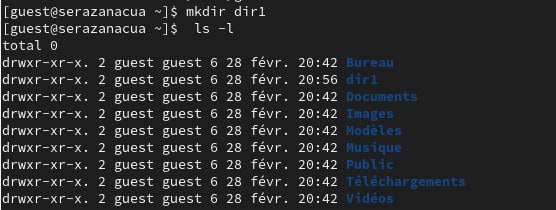{#fig:013 width=70%}

(рис. [-@fig:014]).

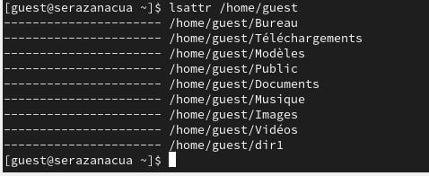{#fig:014 width=70%}
 
 12. Снимите с директории dir1 все атрибуты командой : chmod 000 dir1 (рис. [-@fig:015]).
  
  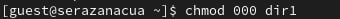{#fig:015 width=70%}
 
и проверьте с её помощью правильность выполнения команды ls -l (рис. [-@fig:016]).

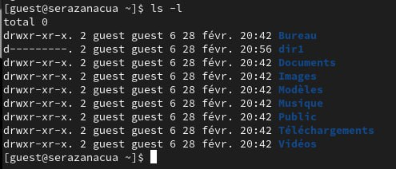{#fig:016 width=70%}

13. Попытайтесь создать в директории dir1 файл file1 командой echo "test" > /home/guest/dir1/file1 (рис. [-@fig:017]).

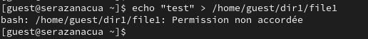{#fig:017 width=70%}

14. Заполните таблицу :

- Замечание 1 
 
 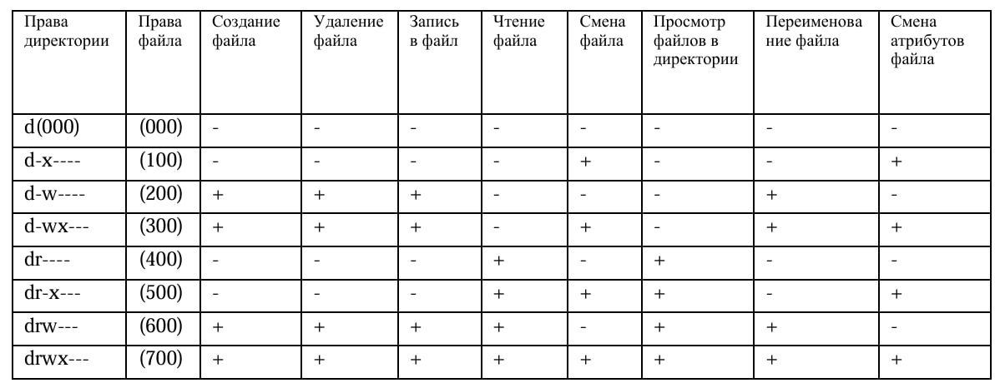{#fig:018 width=70%}
 15. На основании заполненной таблицы определите те или иные минимально необходимые права для выполнения операций внутри директории dir1, заполните табл. 2.2.(рис. [-@fig:019).

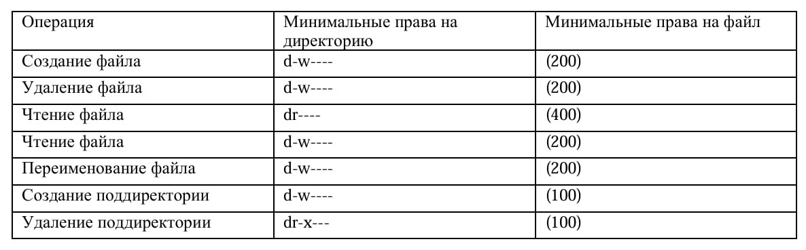{#fig:019 width=70%}
 

# Выводы

- В этой лаборатории мы узнали, как получить практические навыки работы с консолью с атрибутами файлов, закрепить теоретические основы дискреционного разграничения доступа в современных системах с открытым исходным кодом на базе Linux1.

